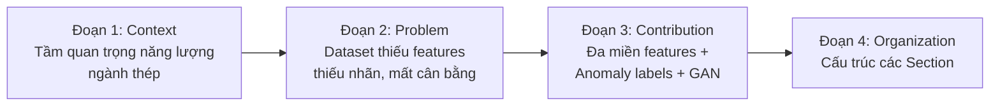

# Hướng Dẫn Viết Introduction — IEEE Format

> Introduction là "cửa ngõ" dẫn ngườii đọc từ bối cảnh chung đến vấn đề cụ thể của bạn. IEEE khuyến nghị Introduction **không quá 2 trang**.

---

## 1. Cấu Trúc Đề Xuất (4 Đoạn)

### Đoạn 1 — Bối Cảnh & Tầm Quan Trọng (Context)
- Mở đầu bằng tầm quan trọng của **tiết kiệm năng lượng công nghiệp**
- Đề cập đến vai trò của **dự báo điện năng** trong quản lý năng lượng
- Nhấn mạnh ngành **thép** là ngành tiêu thụ điện lớn, có đặc thù chu kỳ rõ rệt

> **Gợi ý câu mở đầu:**
> *"The steel industry accounts for approximately 7–9% of global anthropogenic CO₂ emissions, with electricity consumption representing a dominant operational cost. Accurate load forecasting and early detection of electrical anomalies are therefore critical for energy optimization and predictive maintenance in steel manufacturing plants."*

---

### Đoạn 2 — Thách Thức & Vấn Đề Hiện Tại (Problem)
- Dataset công khai (như UCI Steel Industry) chỉ có các biến cơ bản
- Thiếu **đặc trưng vật lý** (công suất biểu kiến, góc lệch pha)
- Thiếu **nhãn bất thường** để huấn luyện mô hình phân loại
- Dữ liệu bất thường quá ít → **mất cân bằng lớp**
- Các phương pháp truyền thống (FFT, thống kê đơn giản) không bắt được tín hiệu phi tuyến, không dừng

> **Gợi ý nội dung:**
> *"Despite the availability of public industrial energy datasets, existing corpora typically provide only raw meter readings without derived physical indicators or anomaly annotations. This limitation constrains the applicability of supervised learning models for fault diagnosis. Furthermore, anomalous events—such as idling motors, insulation degradation, and localized overloads—are rare, resulting in severe class imbalance that degrades classifier performance."*

---

### Đoạn 3 — Giải Pháp Đề Xuất & Đóng Góp (Contribution)
- Tổng quan pipeline của bạn (8 bước)
- Đóng góp chính xác:
  1. **Trích xuất đặc trưng đa miền**: time-domain, frequency-domain (DWT), physical-domain
  2. **Gán nhãn bất thường vật lý**: idling, leakage, overload
  3. **Tăng cường dữ liệu GAN**: sinh mẫu tổng hợp cân bằng lớp

> **Gợi ý nội dung:**
> *"To address these limitations, this paper proposes a systematic preprocessing and dataset construction pipeline for steel industry electricity data. The contributions are threefold: (i) a multi-domain feature engineering framework that augments raw signals with time-lag statistics, Discrete Wavelet Transform (DWT) coefficients, and physically meaningful derivatives including Apparent Power and Phase Angle; (ii) a physics-informed anomaly labeling scheme that identifies idling, energy leakage, and local overload events; and (iii) a Generative Adversarial Network (GAN) for synthetic minority-class augmentation to mitigate data imbalance."*

---

### Đoạn 4 — Tổ Chức Bài Báo (Organization)
- Liệt kê ngắn gọn nội dung từng phần còn lại

> **Gợi ý nội dung:**
> *"The remainder of this paper is organized as follows. Section II reviews related work in industrial energy forecasting, wavelet-based feature extraction, and GAN data augmentation. Section III details the proposed methodology, including data cleaning, feature engineering, anomaly labeling, and synthetic data generation. Section IV describes the dataset and experimental setup. Section V presents the results and discussion. Finally, Section VI concludes the paper and suggests future research directions."*

---

## 2. Sơ Đồ Luồng Introduction (Mermaid)

---

## 3. Từ Vựng & Cụm Từ Hữu Ích

| Tiếng Việt (ý) | Tiếng Anh (viết) |
|----------------|------------------|
| Tiêu thụ điện năng | electricity/energy consumption, load demand |
| Dự báo tải điện | load forecasting, demand prediction |
| Phân loại rủi ro | risk classification, fault diagnosis |
| Tiền xử lý dữ liệu | data preprocessing, data curation |
| Trích xuất đặc trưng | feature engineering, feature extraction |
| Biến đổi Wavelet rời rạc | Discrete Wavelet Transform (DWT) |
| Tăng cường dữ liệu | data augmentation |
| Mạng đối nghịch sinh | Generative Adversarial Network (GAN) |
| Mất cân bằng lớp | class imbalance |
| Bất thường / Sự cố | anomaly, fault, abnormality |
| Chạy không tải | idling, no-load operation |
| Rò rỉ năng lượng | energy leakage, concept drift |
| Quá tải cục bộ | local overload, overcurrent |
| Công suất biểu kiến | Apparent Power (S) |
| Góc lệch pha | Phase Angle (φ) |
| Hệ số công suất | Power Factor (PF) |
| Không dừng (tín hiệu) | non-stationary signal |

---

## 4. Checklist Introduction

- [ ] Mở đầu rộng → thu hẹp dần về chủ đề
- [ ] Không quá 2 trang
- [ ] Đã trích dẫn ít nhất 3–5 tài liệu liên quan
- [ ] Vấn đề được diễn đạt rõ ràng
- [ ] Đóng góp được liệt kê cụ thể (3 điểm chính)
- [ ] Có đoạn tổ chức bài báo
- [ ] Không có kết quả/thảo luận chi tiết (để dành cho Section V)
- [ ] Giọng văn khách quan, học thuật
